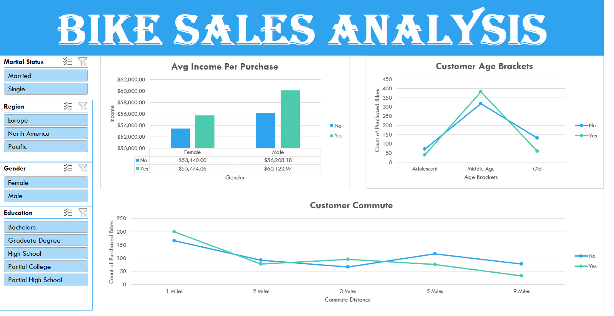

Here’s a **complete professional README.md** for your repo. Just copy–paste this directly 👇

---

# 🚴 Bike Sales Analysis Dashboard (Excel Project)

## 📌 Project Overview

This project focuses on analyzing bike sales data using **Microsoft Excel** to uncover customer purchasing behavior and business insights.

The goal is to transform raw data into an **interactive dashboard** that helps in better decision-making and understanding customer trends. ([shoaibhub.github.io][1])

---

## 📊 Dashboard Preview

---

## 🗂️ Dataset Preview

---

## 📈 Pivot Table Insights

### 🔹 Pivot Table 1

### 🔹 Pivot Table 2

### 🔹 Pivot Table 3

---

## 🛠️ Tools & Techniques Used

* Microsoft Excel
* Data Cleaning
* Pivot Tables
* Pivot Charts
* Slicers (Filters)
* Excel Functions (IF, SUMIF, COUNTIF, etc.)

---

## 🧹 Data Cleaning Process

* Removed duplicate records
* Handled missing/null values
* Standardized categorical data (Gender, Marital Status)
* Created **Age Groups** using IF formula
* Converted raw data into structured format

---

## 📊 Dashboard Features

* Interactive filters (Slicers):

  * Marital Status
  * Region
  * Gender
  * Education

* Visualizations included:

  * Avg Income per Purchase
  * Customer Age Brackets
  * Customer Commute Distance

---

## 🔍 Key Insights

* 💰 Customers with higher income are more likely to purchase bikes
* 👥 Middle-aged group contributes the highest sales
* 🚴 Short-distance commuters (1–3 miles) are more likely to buy bikes
* 👨 Male customers show slightly higher purchasing trends

---

## 💡 Business Recommendations

* Target **middle-aged, high-income customers**
* Focus marketing on **short-distance commuters**
* Customize campaigns based on **region and education level**

---

## 📁 Repository Contents

* `Excel Project Dataset.xlsx` → Raw dataset
* `dashboard.png` → Final dashboard
* `pivot table 1.png`, `pivot table 2.png`, `Pivot Table 3.png` → Analysis
* `Sample Data set.png` → Dataset preview

---

## 🚀 How to Use

1. Download the Excel file
2. Open in Microsoft Excel
3. Use slicers to interact with dashboard
4. Explore insights dynamically

---

## 📌 Conclusion

This project demonstrates how Excel can be used as a powerful tool for **data analysis and visualization**, turning raw data into actionable insights.

---

## 🔗 GitHub Repository

👉 [https://github.com/nsr-dev-in/Bike-Sales-Analysis-Excel-Project](https://github.com/nsr-dev-in/Bike-Sales-Analysis-Excel-Project)

---

## 🙌 Author

**Nitin Singh (NSR Dev)**

Beginner Data Analyst | Learning from Scratch 📊

[1]: https://shoaibhub.github.io/Bike_Sales/?utm_source=chatgpt.com "Project Overview: | Bike_Sales"
[2]: https://topansept.github.io/bike-sales-analysis-excel.html?utm_source=chatgpt.com "Topan - Bike Sales Analysis Using Excel"
